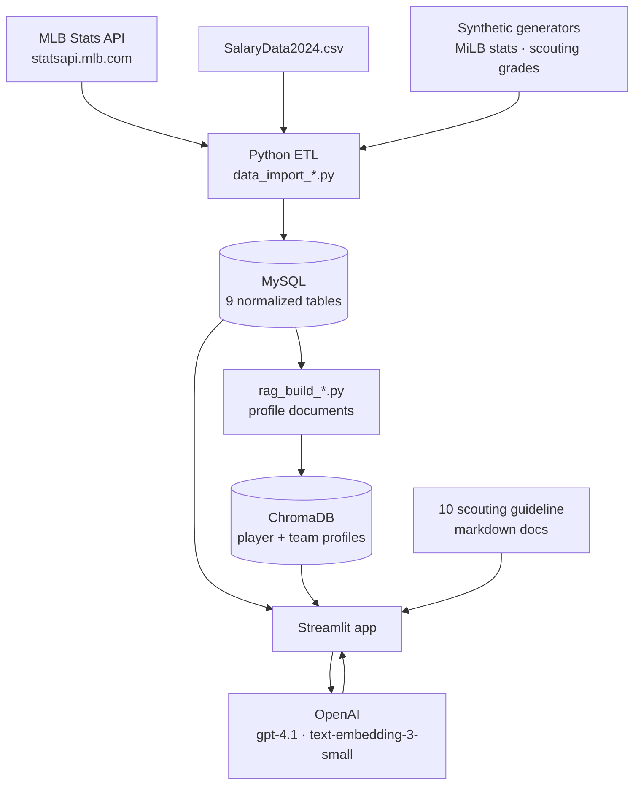

# ⚾ MLB Scouting & Roster Intelligence Platform

A front-office decision tool for Major League Baseball: a normalized MySQL database of
players, contracts, stats, and scouting grades across five league levels, wrapped in a
Streamlit application that lets you query it in plain English, explore it visually, and
ask an AI scouting assistant for roster recommendations.

Built as a graduate database systems project (Oct–Dec 2025) covering the full stack —
requirements, data model, ETL, application, and a retrieval-augmented AI layer.

> **Note:** this application runs against a hosted MySQL instance and the OpenAI API, so
> it is not deployable as a click-through demo. The walkthrough and screenshots below
> show what it does; [Running it yourself](#running-it-yourself) covers local setup.

<!-- SCREENSHOT: create a docs/ folder, add screenshot-dashboard.png, then delete this
comment and the surrounding markers to show the image.

-->

---

## What it does

The app has four modules, selectable from the sidebar.

### 1. SQL Chat — natural language to SQL

Ask a question in English. The app introspects the live database schema, passes it to
`gpt-4.1` along with hand-written schema notes, generates a `SELECT` statement, shows you
the SQL it wrote, and runs it.

> *Which shortstops under 28 had an OPS above .800 in 2024?*

Showing the generated SQL is deliberate — you can check the model's reasoning against the
schema instead of trusting an opaque answer.

<!-- SCREENSHOT: a question, the generated SQL, and the result table.

-->

### 2. Analytics Dashboard — player comparison

Interactive Altair charts over the 2021–2024 seasons, filterable by player type
(hitter/pitcher), season, league level, team, and position:

- **Bar chart** — top N players by any selected metric
- **Scatter plot** — any metric against any other, for finding outliers
- **Line chart** — a metric tracked across seasons to show trajectory

Hitter metrics include AVG, OBP, SLG, OPS, ISO, wOBA, wRC+, hard-hit %, and WAR. Pitcher
metrics include ERA, FIP, xERA, WHIP, strikeouts, and whiff %. Teams render in their
official colors.

### 3. Player Management — CRUD

Full create/read/update/delete against the `Player` table with pagination, partial-match
name search, pre-populated edit forms, and delete confirmation. All queries are
parameterized. See [`CRUD_USAGE_GUIDE.md`](CRUD_USAGE_GUIDE.md) for a walkthrough.

### 4. Scouting Assistant — RAG over the roster

The part that makes this more than a dashboard. Ask an open question about roster
construction and get an answer grounded in both the database and a written scouting
philosophy:

> *Should the Orioles call up a starter or trade for one?*
>
> *Who are realistic trade targets for a contending team needing bullpen help?*

**How it works:**

1. **Query enrichment** — the raw question is rewritten into a retrieval-friendly form,
   with team and position hints parsed out of it.
2. **Retrieval** — Chroma returns the most relevant player-season and team-season profile
   documents, filtered to the selected organization and its minor league affiliates.
3. **Domain grounding** — ten markdown documents encoding front-office reasoning (roster
   evaluation, call-up criteria, trade guidelines, hitter and pitcher scouting scales,
   competitive windows, development philosophy, payroll constraints) are loaded into the
   prompt.
4. **Generation** — `gpt-4.1` answers using only the retrieved context.

The retrieved context is displayed alongside the answer, so you can always see what the
model was actually looking at.

<!-- SCREENSHOT: a scouting question, the answer, and the retrieved context panel.

-->

---

## Architecture



Two retrieval paths share one database. **SQL Chat** translates questions into queries for
precise, countable answers. **Scouting Assistant** retrieves pre-built narrative profiles
for judgment questions where the answer is an argument, not a number.

---

## Data model

Nine tables in third normal form. `Team` self-references through `MLBAffiliateID` to model
parent-club relationships, so a query starting at an MLB organization can walk down to its
AAA, AA, and A affiliates.


| Table | Holds |
|---|---|
| `Player` | Demographics, position, bats/throws, level (MLB / MiLB / College) |
| `League` | League name and level |
| `Team` | Team, city, league, and self-referencing MLB affiliate |
| `Contract` | Salary, signing bonus, service time, contract years, options |
| `HitterStats` | Per season: counting stats plus OPS, ISO, wOBA, wRC+, hard-hit %, WAR |
| `PitcherStats` | Per season: counting stats plus ERA, FIP, xERA, WHIP, whiff % |
| `ScoutingReport` | 20–80 scale grades — contact, power, run, field, arm, velocity, spin, breaking ball, overall |
| `Trade` / `TradeDetails` | Trade events and the players moving between teams |
| `TeamHistoricalData` | Season records, playoff and World Series flags, team-level rates |

Full DDL in [`05_DDL_schema_v1.sql`](05_DDL_schema_v1.sql); design notes in
[`schema_notes.md`](schema_notes.md); DBML source in
[`04_ERD_diagram_v1.dbml`](04_ERD_diagram_v1.dbml).

### Where the data comes from

- **MLB Stats API** — players, teams, leagues, and 2021–2024 hitting, pitching, and team
  records
- **`SalaryData2024.csv`** — contract and payroll data
- **Synthetic generation** — minor league stat lines and scouting grades, since granular
  MiLB stats and real scouting reports are not publicly available. Generated from
  position- and level-appropriate distributions so the roster logic has realistic inputs
  to work with.

---

## Running it yourself

**Prerequisites:** Python 3.11+, a MySQL 8 database, and an OpenAI API key.

```bash
git clone https://github.com/ptetalicoder/MLBScoutingProject.git
cd MLBScoutingProject
pip install -r requirements.txt
```

Create a `.env` file in the project root:

```env
DB_HOST=your-mysql-host
DB_PORT=3306
DB_USER=your-user
DB_PASSWORD=your-password
DB_NAME=your-database
OPENAI_API_KEY=sk-...
```

**1. Create the schema**

```bash
mysql -h $DB_HOST -u $DB_USER -p $DB_NAME < 05_DDL_schema_v1.sql
```

**2. Load the data** — order matters, since later tables carry foreign keys into earlier
ones:

```bash
python data_import_league_team.py          # leagues and teams first
python data_import_player.py               # then players
python data_import_hitter_stats.py
python data_import_pitcher_stats.py
python data_import_team_historical_data.py
python data_import_contract.py             # reads SalaryData2024.csv
python data_import_fake_minor_stats.py     # synthetic MiLB stat lines
python data_import_scouting_report.py      # synthetic scouting grades
```

**3. Build the vector store** — writes a local `.chromadb/` directory and calls the OpenAI
embeddings API, so expect it to take a few minutes and cost a small amount:

```bash
python rag_build_player_profiles.py        # -> player_season_profiles
python rag_build_team_profiles.py          # -> team_season_profiles
```

**4. Run the app**

```bash
streamlit run 07_mlb_assistant_app.py
```

Opens at http://localhost:8501.

> Steps 2 and 3 must both finish before the Scouting Assistant works — it calls
> `get_collection()` and will error if the collections do not exist yet. SQL Chat, the
> dashboard, and CRUD only need steps 1 and 2.

---

## Repository map

Numbered files follow the order the project was built in — requirements, then data model,
then application.

**Application**

| File | Purpose |
|---|---|
| [`07_mlb_assistant_app.py`](07_mlb_assistant_app.py) | The Streamlit app — all four modules |
| [`player_crud.py`](player_crud.py) | Reusable `PlayerCRUD` class with parameterized queries |

**Data model**

| File | Purpose |
|---|---|
| [`01_PRD_v1.md`](01_PRD_v1.md) | Product requirements — audience, modules, scope |
| [`03_entities_attributes_v1.md`](03_entities_attributes_v1.md) | Entity and attribute definitions |
| [`04_ERD_diagram_v1.dbml`](04_ERD_diagram_v1.dbml) | ERD source (DBML) |
| [`05_DDL_schema_v1.sql`](05_DDL_schema_v1.sql) | `CREATE TABLE` statements |
| [`schema_notes.md`](schema_notes.md) | Schema notes fed to the SQL-generation prompt |
| [`queries.sql`](queries.sql) | Example analytical queries |

**ETL** — `data_import_*.py`, one per table, plus [`Data_API.md`](Data_API.md) documenting
the MLB Stats API endpoints used.

**RAG** — [`rag_build_player_profiles.py`](rag_build_player_profiles.py) and
[`rag_build_team_profiles.py`](rag_build_team_profiles.py) build the Chroma collections;
[`rag_query_enricher.md`](rag_query_enricher.md) holds the query-rewriting prompt.

**Scouting knowledge base** — the numbered markdown files (`01_roster_evaluation.md`
through `12_example_scouting_reports_and_recommendations.md`) encode front-office
reasoning and are loaded into the assistant's prompt at runtime.

---

## Tech stack

**Python** · **MySQL** · **Streamlit** · **ChromaDB** · **OpenAI** (`gpt-4.1`,
`text-embedding-3-small`) · **Altair** · **pandas** · **MLB Stats API**

---

## Author

**Pranav Tetali** — MS Business Analytics, SMU Cox

[Portfolio](https://ptetalicoder.github.io/Portfolio/) ·
[LinkedIn](https://linkedin.com/in/pranavtetali) ·
[GitHub](https://github.com/ptetalicoder)
